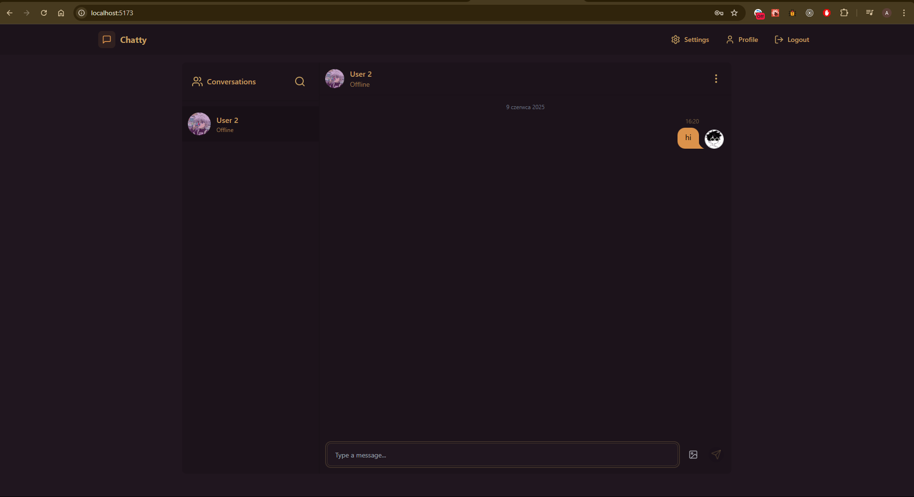
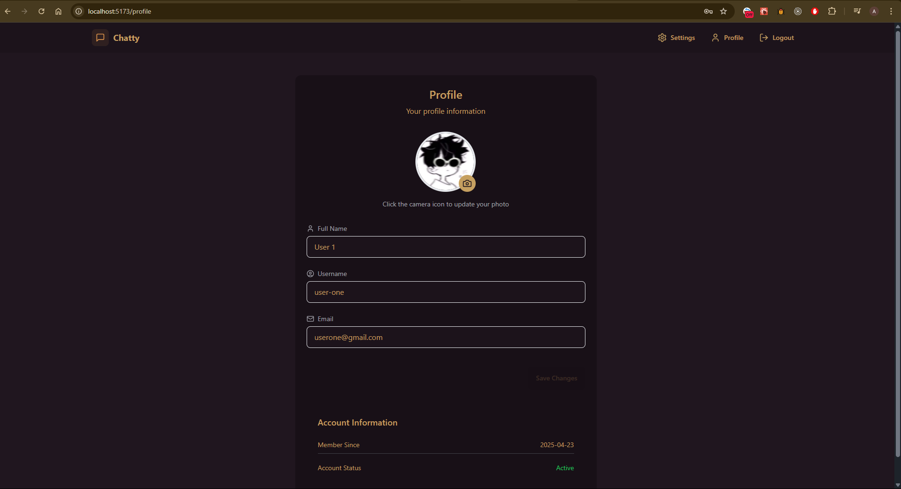
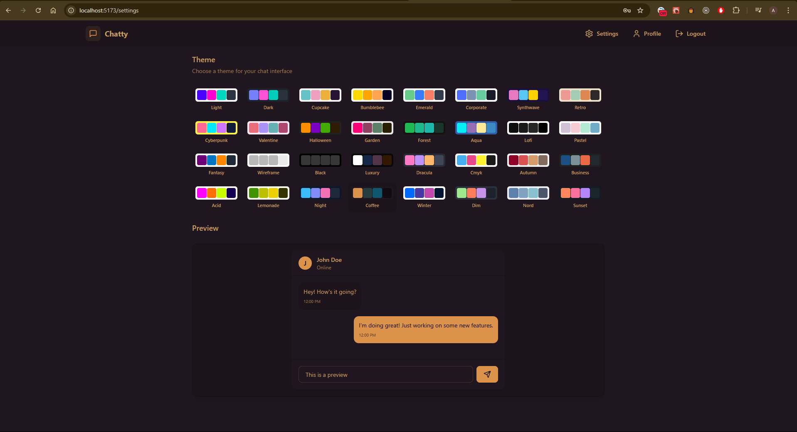
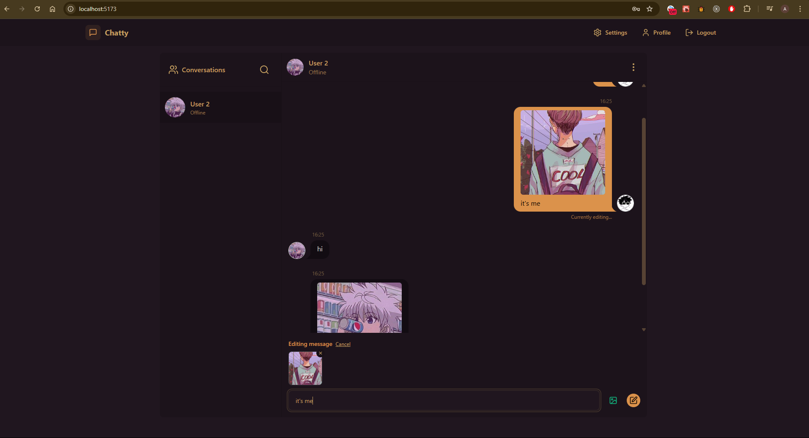
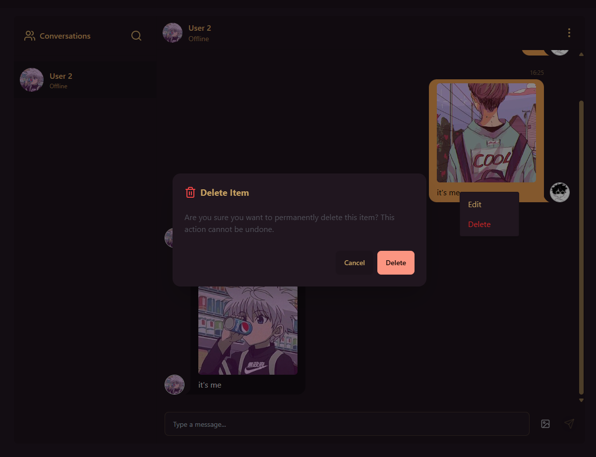
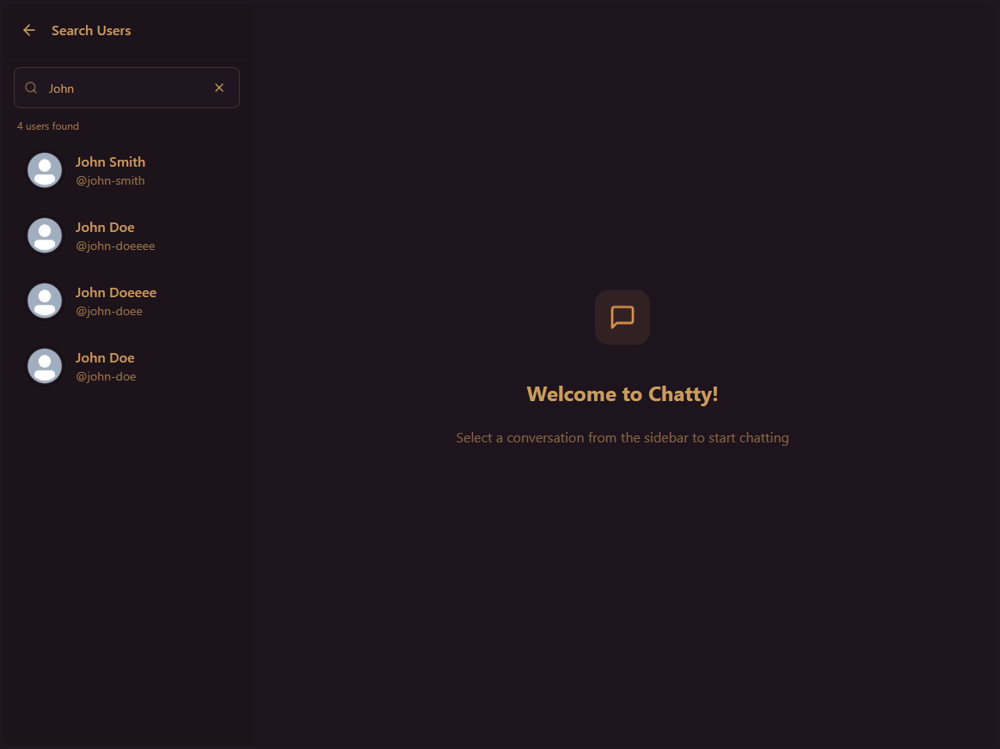
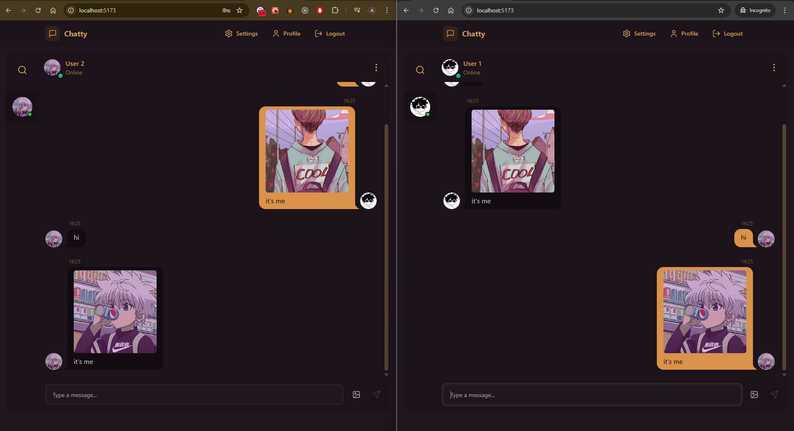

# 💬 Chatty — Elegancka aplikacja do czatu w czasie rzeczywistym

## 👨‍💻 Autor

**Imię i nazwisko:** Anton Ovod  
**Grupa laboratoryjna:** IO 6.3

[🇺🇸 Read in English](./README.md) | [🇺🇦 Читати українською](./README-UA.md)

---

## 🧾 Opis projektu

**Chatty** to nowoczesna, funkcjonalna aplikacja czatowa, stworzona z myślą o błyskawicznej komunikacji w eleganckim wydaniu. Niezależnie od tego, czy rozmawiasz z jedną osobą, czy zarządzasz swoim profilem — Chatty zapewnia szybkie, responsywne i intuicyjne działanie.

Aplikacja wykorzystuje WebSockety do aktualizacji w czasie rzeczywistym, oferuje przejrzysty interfejs, możliwość edytowania wiadomości, wyszukiwania użytkowników oraz pełną personalizację — wszystko oparte na solidnej architekturze full-stack.

---

## ✨ Kluczowe funkcje

Co możesz zrobić z Chatty?

1. 🔐 **Uwierzytelnianie użytkownika** – Rejestracja, logowanie i wylogowywanie w bezpieczny sposób.
2. 💬 **Czat w czasie rzeczywistym** – Dzięki Socket.IO rozmowy są natychmiastowe i płynne.
3. ✏️ **Edycja i usuwanie wiadomości** – Możesz poprawić lub usunąć wiadomość nawet po jej wysłaniu.
4. 👤 **Zarządzanie profilem** – Personalizacja nazwy użytkownika, avatara i innych danych.
5. 🔍 **Wyszukiwanie** – Szybko znajdziesz użytkowników lub rozmowy.
6. 📱 **Responsywny design** – Działa doskonale na komputerach, tabletach i smartfonach.
7. 🎛️ **Ustawienia użytkownika** – Możliwość zmiany motywu i dostosowania preferencji.

---

## 🛠️ Technologie

Projekt powstał z użyciem nowoczesnego stosu technologicznego (full-stack):

### 🌐 Frontend

- **React.js** — Rozwijanie interfejsu użytkownika w oparciu o komponenty
- **TypeScript** — Silne typowanie dla większej skalowalności i bezpieczeństwa
- **Vite** — Superszybkie środowisko deweloperskie
- **Tailwind CSS** — Stylowanie w stylu utility-first
- **Zustand** — Minimalistyczny i wydajny menedżer stanu

### 🔧 Backend

- **Node.js** + **Express** — Lekka i elastyczna platforma serwerowa
- **TypeScript** — Typowanie również po stronie serwera
- **Zod** — Walidacja schematów i wnioskowanie typów
- **Socket.IO** — Komunikacja WebSocket w czasie rzeczywistym

### 💾 Infrastruktura

- **MongoDB** — NoSQL baza danych do przechowywania wiadomości i użytkowników
- **Cloudinary** — Hosting i optymalizacja zdjęć profilowych
- **PNPM** — Szybki i oszczędny menedżer pakietów

---

## 🖼️ Podgląd interfejsu

Poniżej znajdziesz przegląd najważniejszych ekranów i funkcji Chatty:

### 🏠 Strona główna

Przejrzysty widok startowy z dostępem do rozmów i funkcji.

---

### 👤 Strona profilu

Przeglądaj i edytuj dane swojego konta.

---

### ⚙️ Panel ustawień

Dostosuj wygląd aplikacji i osobiste preferencje.

---

### ✍️ Edycja wiadomości

Popraw wysłaną wiadomość bezpośrednio w czacie.

---

### 🗑️ Potwierdzenie usunięcia wiadomości

Zabezpieczenie przed przypadkowym usunięciem treści.

---

### 🔎 Wyszukiwanie użytkowników i rozmów

Szybki dostęp do kontaktów i historii konwersacji.

---

### 🔄 Komunikacja WebSocket

Bieżące aktualizacje w czasie rzeczywistym między użytkownikami.

---

## ✅ Podsumowanie

**Chatty** to przykład nowoczesnego podejścia do projektowania aplikacji full-stack — łączy komunikację w czasie rzeczywistym, responsywny wygląd oraz rozbudowane funkcje w jednym, estetycznym i dobrze zaprojektowanym narzędziu.

---
