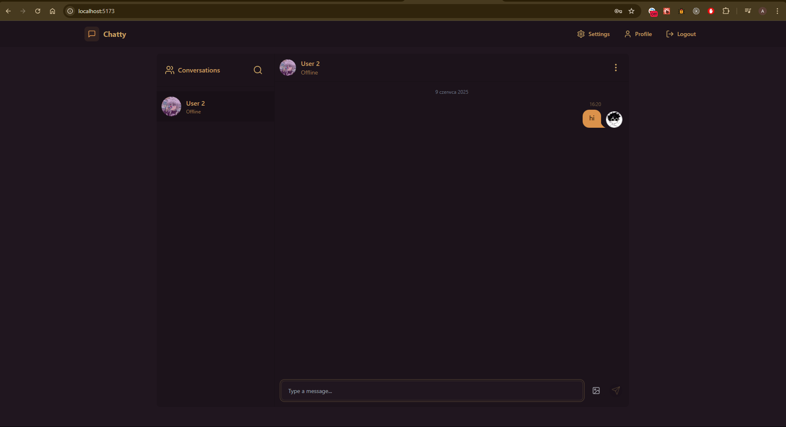
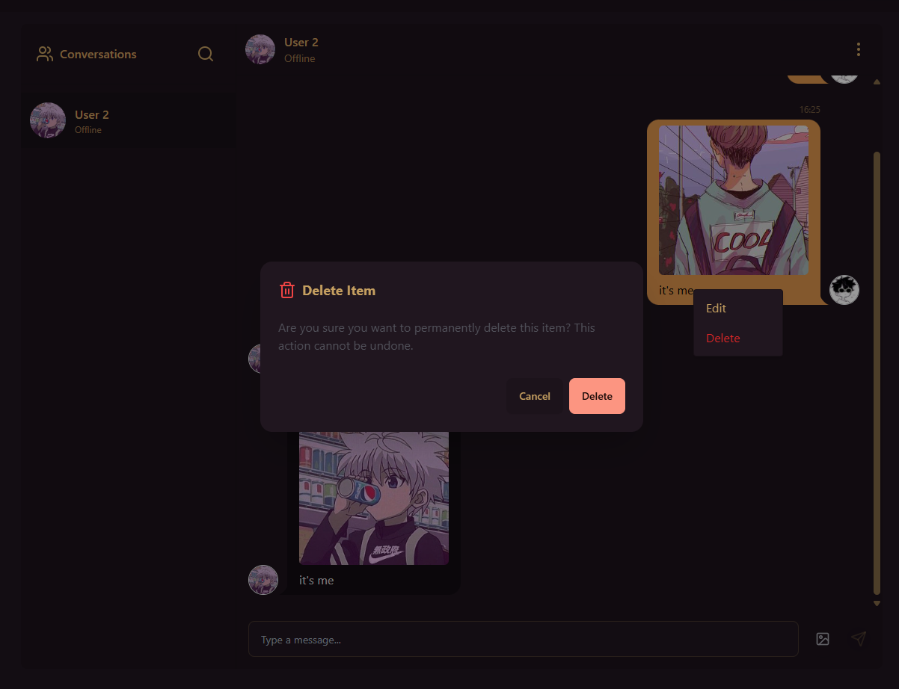

# 💬 Chatty — A Sleek Real-Time Chat Application

## 👨‍💻 Author

**Name:** Anton Ovod  
**Laboratory Group:** IO 6.3

[🇵🇱 Czytaj po polsku](./README-PL.md) | [🇺🇦 Читати українською](./README-UA.md)

---

## 🧾 Project Description

**Chatty** is a streamlined, feature-rich chat application designed for instant communication with a modern touch. Whether you're messaging one-on-one or managing your personal space, Chatty ensures a fast, responsive, and smooth experience.

It leverages WebSockets for real-time updates, boasts a sleek and responsive UI, and provides useful tools like message editing, user search, and profile customization — all built on a robust full-stack architecture.

---

## ✨ Key Features

Here’s what you can do with Chatty:

1. 🔐 **User Authentication** – Secure signup, login, and logout functionality.
2. 💬 **Real-Time Messaging** – Powered by Socket.IO for seamless, live conversations.
3. ✏️ **Edit & Delete Messages** – Refine or remove your messages post-send.
4. 👤 **User Profile Management** – Customize your display name, avatar, and other profile details.
5. 🔍 **Search Functionality** – Quickly find users or past conversations.
6. 📱 **Responsive Design** – Looks great and works flawlessly across all devices.
7. 🎛️ **User Settings** – Choose themes and configure preferences.

---

## 🛠️ Tech Stack

This project was built using a modern, full-stack toolchain:

### 🌐 Frontend

- **React.js** — Component-based UI development
- **TypeScript** — Strong typing for scalable code
- **Vite** — Lightning-fast dev environment
- **Tailwind CSS** — Utility-first styling
- **Zustand** — Simple yet powerful state management

### 🔧 Backend

- **Node.js** + **Express** — Lightweight server framework
- **TypeScript** — Backend type safety
- **Zod** — Schema validation and type inference
- **Socket.IO** — WebSocket-based communication

### 💾 Infrastructure

- **MongoDB** — NoSQL database for messages and user data
- **Cloudinary** — Efficient image storage and delivery
- **PNPM** — Fast, disk space–efficient package manager

---

## 🖼️ Interface Previews

Here’s a quick tour of Chatty’s core UI components and features:

### 🏠 Home Page

A clean entry point with access to your conversations and features.

---

### 👤 Profile Page

View and edit your personal information with ease.

---

### ⚙️ Settings Panel

Tweak your preferences and switch between themes.

---

### ✍️ Edit Messages

Modify previously sent messages directly in the chat.

---

### 🗑️ Message Deletion Confirmation

Ensure accidental deletions don't go unchecked.

---

### 🔎 Conversation & User Search

Find messages and users in seconds.

---

### 🔄 WebSocket Communication

Live updates across users using Socket.IO.

---

## ✅ Conclusion

**Chatty** exemplifies a clean, modern approach to full-stack development — delivering real-time communication, responsive design, and rich features with solid code practices and a delightful user experience.
